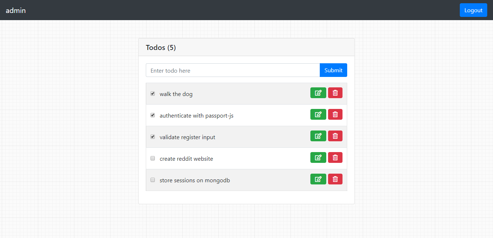

Sample TODO App
================



## Dependencies

The follow dependencies are in use:

- NextJS
- React
- Typescript (TSX)
- Tailwind CSS
- Storybook


## Getting Started

1. Install Docker and VSCode Dev Containers, if you have not already done so. [https://github.com/myrtleTree33/todo-app-react](https://github.com/myrtleTree33/todo-app-react)
2. Clone this repository and ensure you have the development environment set up.
3. Run the development server:

```bash
$ npm run dev
```

Open [http://localhost:3000](http://localhost:3000) with your browser to see the result.

You can start editing the page by modifying `pages/index.tsx`. The page auto-updates as you edit the file.


## Storybook Development

View components in storybook by running the below command:

```bash
$ npm run storybook
```

Open [http://localhost:6006](http://localhost:6006) with your browser to see the result.
